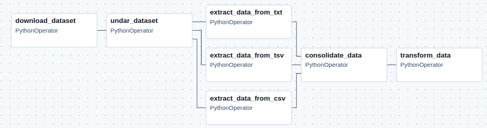
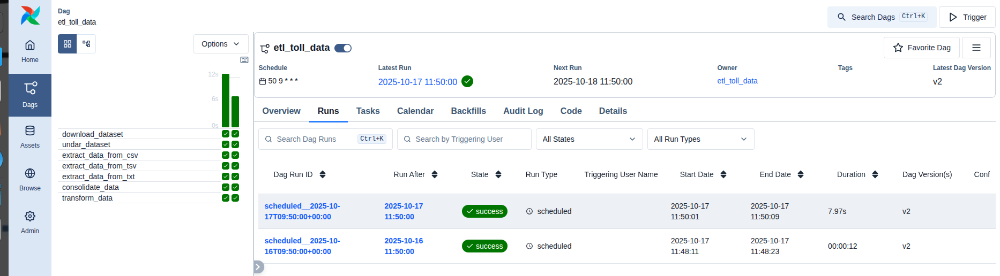

# Extract, Transform and Load (ETL) Toll Data
Ce projet implémente un pipeline ETL automatisé permettant l'extraction, la transformation et le chargement des données issues de stations de péage afin de facilité leur analyse et leur exploitation.

# ETL Process in Airflow Platform

